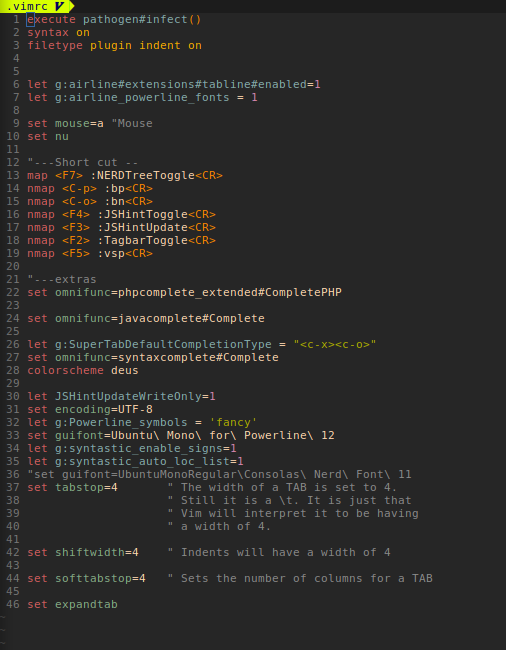

```
 _     _______ _____ ___         _   _   ____  _     
\ \   / / ____|_   _|_ _| __   _/ | / | | ___|| |__  
 \ \ / /|  _|   | |  | |  \ \ / / | | | |___ \| '_ \ 
  \ V /_| |___ _| |_ | |   \ V /| |_| |_ ___) | |_) |
   \_/(_)_____(_)_(_)___|   \_/ |_(_)_(_)____/|_.__/ 
    

```

# Vim Essential Tool Installer (VETI) 

> Simple Assistance For quick install minimum requirement  for VIM 


 


## About 
----

**VETI**  is a quick installation wizard for vim allowing a quick basic configuration and allows to dynamically add links for sharing within the community of vim


## WHY VETI 

I saw that many user who wanted to install vim go after download Pluging on the net through github and encouter Problems to configure vim ...

this installer doest it for you also save time 

it also costomisable as will and offers you the possibility to share your config on this depot with a simple **Pull Request**  

* you can use a Docker container to run veti in an isolated environment test 
->  you can pull the image base from Docker hub
 
```bash 

docker  pull jukoo/veti  

# and then you run 

docker run -ti Jukoo/veti # you can use directly this command  is more usefull  

# when you are inside the container  you can execute the following command to run veti 
./veti  
# or 
bash veti 

``` 

## easy Install 


## CLONE AND LAUNCH
----

```bash

git clone https://github.com/Jukoo/Veti.git

```
**Launch**

```bash
chmod +x veti 

# By default veti need connexion to work and download the required package to make the installation  
./veti

# but  you can run on offline mode  [useless] it 'll just list packages already installed and plugins to download 
but it can be used to rebuild an incorrectly configured file 

./veti no-check 

```
> :bulb: _please report issue to help me_ 

# .vimrc file config 




> You can change the configuration of .vimrc to your and adopt it in your way:

  here are the useful shortcuts that I put in basic

  Crtl + o and Ctrl + p (to navigate between tabs)

  F7 (NERDTreeToogle)
  F5 (vertical split)
  F2 (TagbarToogle)

* default Theme **Deus**


# usefull resources  

[Vim colorscheme ](http://vimcolors.com)

[Vim Devicons](https://github.com/ryanoasis/vim-devicons)

# VIM Peview 


## LOVE PULL REQUESTS 

I am open to any proposal and participation to extend the possibilities of the script and to share it with so many people


### Creator

* Jukoo (@jukoo)
---

### Contributor
    
> this project is maintained by the author for the moment (@jukoo) 
